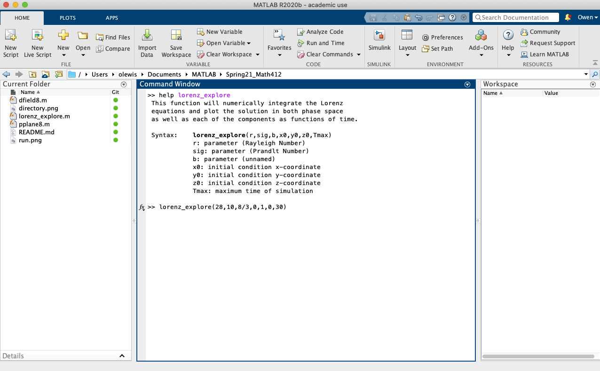

<h1> Math 412 - 001</h1>

This repository will serve as a way to distribute useful code and software for use during the term. 
It will be updated as regularly as I can manage. 


<h2>Matlab</h2>

Matlab is a general purpose mathematics and computing environment sold by MathWorks.
As a UNM Student, you have access to a free download of Matlab with your UNM ID. 
To install it on your personal computing device, follow the instructions found on the UNM IT website [here](http://it.unm.edu/download/). 


<h2>PPlane and DField</h2>

PPlane and Dfield are useful tools which have been written in the Matlab programming language. 
Dfield can be used to visualize the phase line and solutions to one-dimensional dynamical systems.
PPlane is used to visualize the phase plane and solutions/trajectories of two-dimensional systems. 
They provide many other useful functions including but not limited to:
* Visualizing null-clines
* Finding fixed points
* Calculating the Jacobian (and eigenvalues/eigenvectors) at fixed points.
* Calculating "nearly closed" trajectories
* Exporting pictures of the phase plane and trajectories

Both tools can be downloaded from various places on the internet, including the [Matlab File Exchange](https://www.mathworks.com/matlabcentral/fileexchange/). 
However, I do not suggest downloading the PPlane version found there. 
The Matlab programming language has been updated a few times in the past 4 years and PPlane has not. 
This means that using the publicly available PPlane with modern instalations of Matlab will result in errors, which is the main reason I decided to create this repository. 
In this repository you will find a slightly edited version of the PPlane source file. 
I have changed a single line in the PPlane source file to ensure that it works with the most recent versions of Matlab (thanks to user Hil Meijer on the file exchange forums). 
I have tested in on Matlab 2020 and Matlab 2021.
Hopefully it will continue to work for the forseeable future.

<h3>Installing PPlane and DField</h3>

Download one or both files to your local computer where you have Matlab installed. 
They can be found above ([pplane](https://github.com/OwenLewis/Spring21_Math412/blob/master/pplane8.m) and [dfield](https://github.com/OwenLewis/Spring21_Math412/blob/master/dfield8.m)).
It does not matter precisely which folder you place them in, but put them somewhere that you will remember and they will not get lost in the clutter. 
Open Matlab as you normally would. 
Navigate to the directory where you have saved pplane8.m and dfield8.m. 
This can be done one of two ways.
One option is to use commands in the "Command Window".
For example, you could type the command

```matlab
	cd ~/directory/where/pplane/is/located

```
and hit enter. 
Alternately, you could simply click the appropriate folders shown in the "Current Folder" window. 
The bar above the Command Window will show you which directory Matlab considers the "current directory" (shown in the red circle below). 
You will know you're in the correct directory when you see the appropriate files in the "Current Folder" window (shown in the green circle below).


Now you simply need to run the command
```matlab
	pplane8
```
and PPlane should fire right up (see screenshot). 
Happy phase-planing!


<h2>Lorenz_Explore</h2>
I have added my own file named "lorenz_explore.m" to the repository. 
It is designed to simply integrate the Lorenz equations for various parameter values and plot the results. 
The purpose is for you to explore the various behaviors that existing within this shockingly diverse dynamical system. 
To begin, download it as you would any of the other files in the repository, make sure the file is in the directory of your choice, and navigate to that directory in Matlab. 
If you ever forget how to use this program, you can type 

```matlab
	help lorenz_explore
```
and Matlab will print a small reminder for you (see screenshot). 



To run the program, you can call it with 7 arguments:
* The parameter r
* The parameter sigma
* The parameter b
* Your preferred initial condition for the x-coordinate
* Your preferred initial condition for the y-coordinate
* Your preferred initial condition for the z-coordinate
* The amount of time you wish to draw the solution for.

For example, you could type

```matlab
	lorenz_explore(28,10,8/3,0,1,0,30)
```

The program will numerically approximate the solution and plot two figures. 
Figure 1 will show the trajectory in 3-D phase space.
Figure 3 will show the x, y, and z components of the soluton as functions of time in three separate panels (along with some relevant fixed points).
See the screenshot below.

